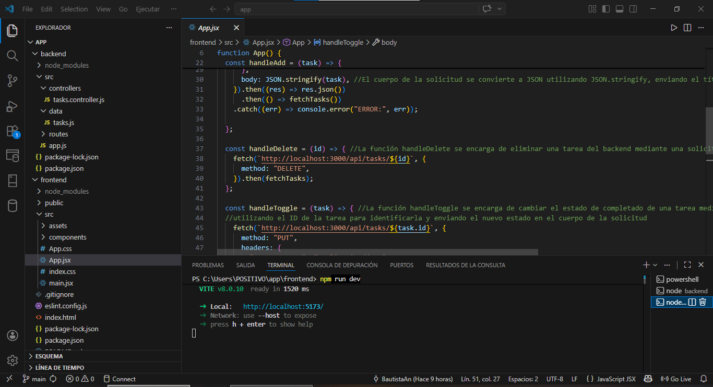
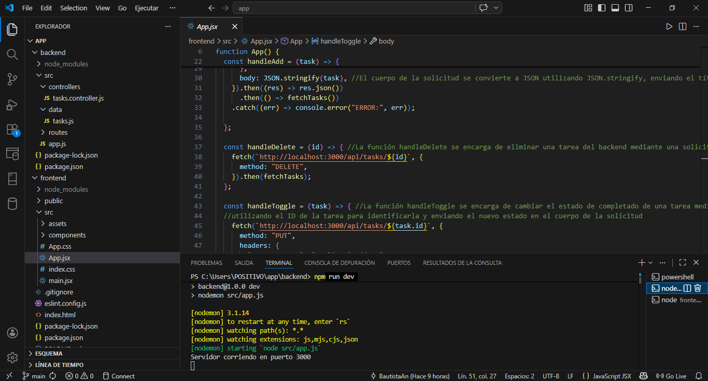
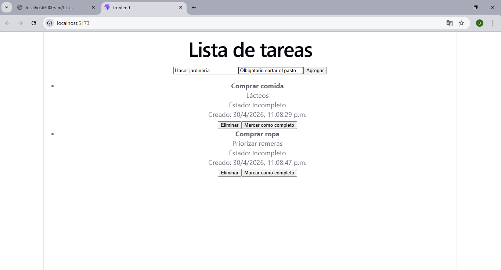
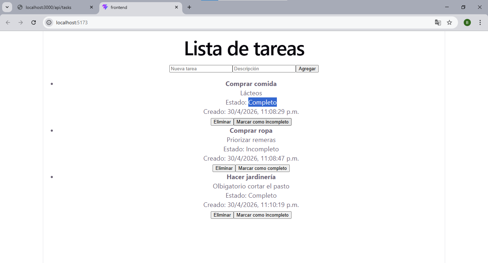
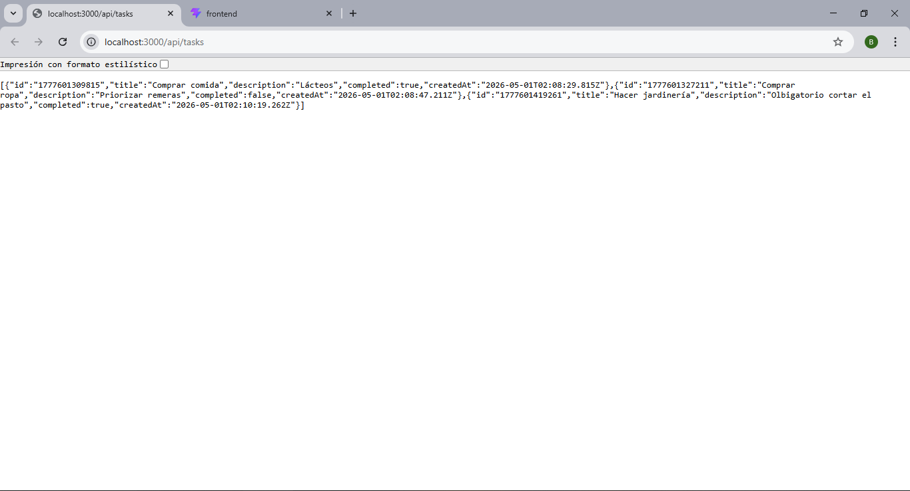
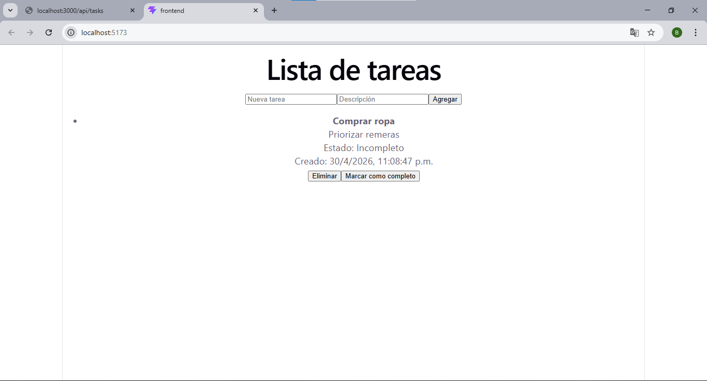
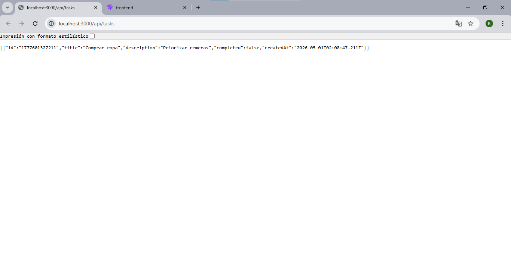

# Task Manager App 

- Aplicación fullstack desarrollada con React y Express que implementa operaciones CRUD mediante una API REST.

---

## Tecnologías utilizadas

### Backend
- Node.js
- Express

### Frontend
- React (Vite)
- JavaScript
- Fetch API

---

## Estructura del proyecto

- app/
- | backend/
- | frontend/
- | README.md


---

## Instalación y ejecución

### 1. Clonar el repositorio

```bash
git clone https://github.com/BautistaANun/App.git
cd app 
```

### 2. Ejecutar backend en una terminal

```bash
cd backend
npm install
npm run dev
```

```bash 
El servidor va a correr en:
http://localhost:3000
```
### 3. Ejecutar frontend abriendo otra terminal distinta

```bash
cd frontend
npm install
npm run dev
```
```bash
Aplicación disponible en:
http://localhost:5173
```

## API Endpoints
- GET /api/tasks -> obtener tareas
- POST /api/tasks -> crear tarea
- PUT /api/tasks/:id -> actualizar tarea
- DELETE /api/tasks/:id -> eliminar tarea


## Funcionalidades
- Crear tareas
- Listar tareas
- Marcar como completas / incompletas
- Eliminar tareas


## Consideraciones
- Los datos se almacenan en memoria (se pierden al reiniciar el servidor)
- No hay base de datos persistente

## Requisitos
- Node.js instalado
- npm


## Screenshots

### Screenshot 1: App funcionando en frontend

### Screenshot 2: App funcionando en backend

### Screenshot 3: Inputs llenos para agregar tareas

### Screenshot 4: Cambios de estado (Completo/Incompleto)

### Screenshot 5: Vista desde el backend luego de interactuar con las tareas

### Screenshot 6: Imagen post eliminación de tareas mediante el botón "Eliminar"

### Screenshot 7: Actualización del backend luego de eliminar tareas


